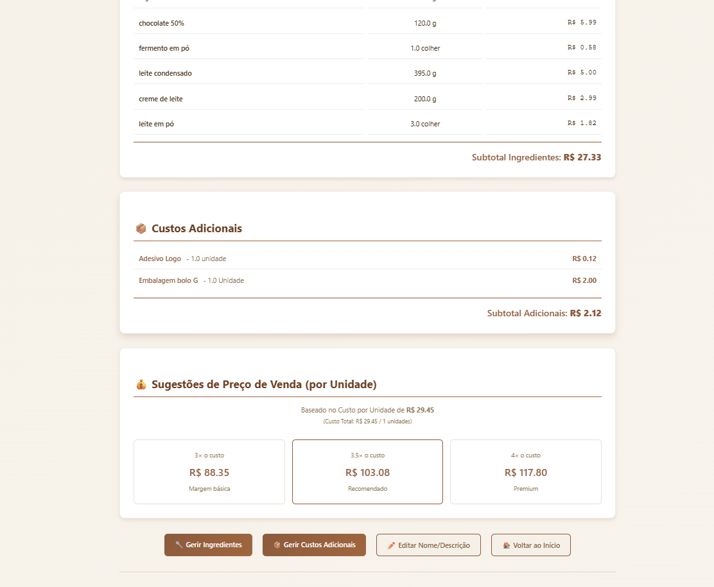
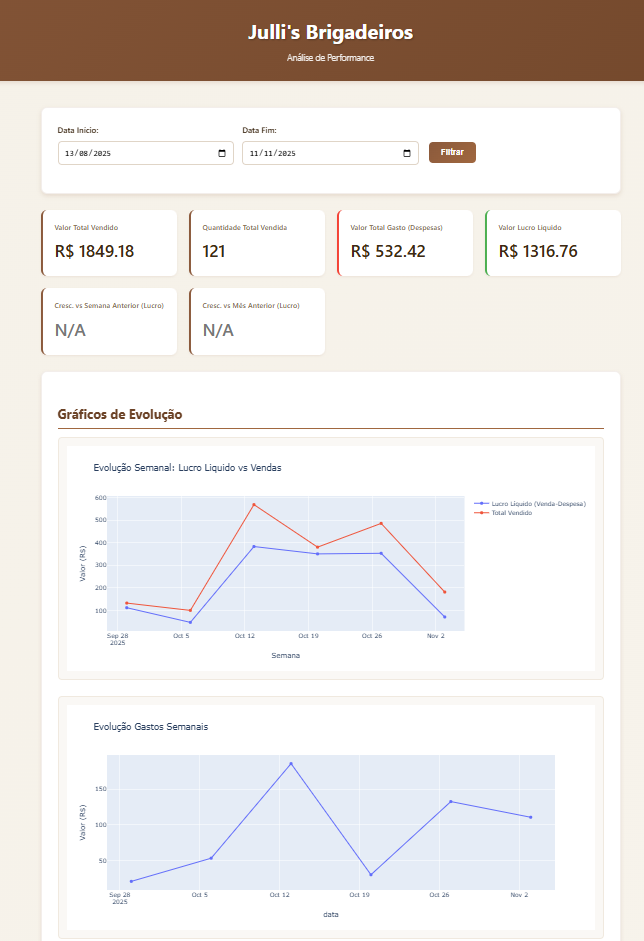

# 🧁 Sistema de Gestão e BI para Confeitaria (Julli's Brigadeiros)

Este é um projeto full-stack de um sistema de gestão 360° (ERP/BI) focado em resolver o principal desafio de confeitarias artesanais e pequenos negócios: **a precificação estratégica.**

Muitos microempreendedores definem seus preços com base no "achismo" ou copiando a concorrência, sem entender seu custo real. Isso leva a margens de lucro baixas (ou até prejuízo) e à falência do fluxo de caixa.

Esta aplicação substitui o "achismo" por **dados**, oferecendo uma plataforma completa que calcula o Custo Unitário real (CMV) e fornece um dashboard de BI para uma tomada de decisão inteligente.

**Acesse a aplicação no ar:** [**https://viniciusstoc.pythonanywhere.com/**](https://viniciusstoc.pythonanywhere.com/)

---

## 📸 Showcase (Principais Telas)

*(Nota: Substitua as URLs abaixo pelos seus próprios prints de tela. O GitHub permite que você arraste e solte imagens diretamente no `README.md` para gerar o link).*

| Painel de Precificação (Custo Unitário) |  Dashboard de BI (Lucro Líquido)   |
|:---------------------------------------:|:----------------------------------:|
|     )      |  |

---

## ✨ Funcionalidades Principais

O sistema é dividido em 4 grandes módulos que se conectam:

### 1. 📦 Módulo de Catálogo (O Alicerce)
Onde todos os custos são definidos.
* **Gerir Ingredientes:** CRUD completo para o catálogo de ingredientes (ex: Farinha, Leite Condensado), registrando o preço da embalagem e a quantidade em gramas.
* **Gerir Custos Adicionais:** Cadastro de custos fixos e variáveis (ex: Gás, Embalagem, Adesivo, Salário da Dona).

### 2. 🧠 Módulo de Precificação (O Cérebro)
Onde a inteligência de custo é aplicada.
* **Livro de Receitas Digital:** Criação de receitas (ex: "Massa de Cookie") associando ingredientes e custos do catálogo.
* **Lógica de "Rendimento":** A funcionalidade chave. O usuário informa o custo do lote (calculado automaticamente) e o **Rendimento** (quantas unidades a receita produz, ex: 15 cookies).
* **Sugestão de Preço:** O sistema calcula o **Custo Unitário** (`Custo do Lote / Rendimento`) e sugere preços de venda com margens de lucro saudáveis (3x, 3.5x, 4x).
* **Gestão de Receitas:** Otimização de fluxo com botões para **Editar**, **Excluir** e **Duplicar** receitas-base.

### 3. 🛍️ Módulo de Operação (O Dia a Dia)
Onde os dados transacionais são coletados.
* **Gestão de Produtos:** Criação de produtos vendáveis (ex: "Cookie de Nutella") associando uma ou mais receitas da base de custo.
* **Lançamentos Financeiros:**
    * **Vendas:** Registro de vendas (puxando o Custo de Produção e o Preço de Venda corretos).
    * **Despesas:** Registro de gastos operacionais (aluguel, marketing, etc.).
* **Gestão de Lançamentos:** Tela dedicada para visualizar e **Excluir** vendas ou despesas registradas incorretamente, garantindo a integridade do banco de dados.

### 4. 📊 Módulo de BI (O Resultado)
Onde os dados se transformam em inteligência acionável.
* **Dashboard Interativo:** Construído com **Pandas** e **Plotly**, o dashboard exibe os KPIs mais importantes.
* **Análise de Fluxo de Caixa:** `Valor Total Vendido` vs. `Valor Total Gasto (Despesas)` = `Lucro Líquido`.
* **Análise de Crescimento:** Comparativo de Lucro Líquido vs. Semana Anterior e Mês Anterior (WoW, MoM).
* **Análise de Rentabilidade:** Gráficos Top/Bottom 3 de produtos por Quantidade, Valor Vendido e (o mais importante) **Lucro Bruto**, expondo quais produtos são "heróis" e quais são "vilões" do caixa.

---

## 🛠️ Stack de Tecnologias

* **Backend:** **Python 3** com **Flask** (para roteamento, lógica e servidor web).
* **Análise de Dados (BI):** **Pandas** (para manipulação, agregação e cálculos de KPIs) e **Plotly** (para visualizações de dados interativas).
* **Banco de Dados:** **SQLite** (para armazenamento persistente dos dados).
* **Frontend:** **HTML5**, **CSS3** (para layout) e **JavaScript** (para interatividade, como preenchimento dinâmico de formulários e envio de JSON).
* **Versionamento:** **Git** e **GitHub**.
* **Deploy:** **PythonAnywhere**.

---

## 🚀 Como Rodar Localmente

Para rodar este projeto no seu computador:

1.  **Clone o repositório:**
    ```bash
    git clone [https://github.com/Viniciustoc/Sistema-de-Precifica-e-Controle-Financeiro.git](https://github.com/Viniciustoc/Sistema-de-Precifica-e-Controle-Financeiro.git)
    cd Sistema-de-Precifica-e-Controle-Financeiro
    ```

2.  **Crie e Ative um Ambiente Virtual:**
    ```bash
    # (Windows)
    python -m venv venv
    .\venv\Scripts\activate
    ```

3.  **Crie o `requirements.txt`:**
    *(Crie um arquivo `requirements.txt` na pasta principal e adicione o conteúdo abaixo):*

    ```
    Flask
    pandas
    plotly
    ```

4.  **Instale as dependências:**
    ```bash
    pip install -r requirements.txt
    ```

5.  **Execute a Aplicação:**
    O `main.py` irá automaticamente criar e inicializar o banco `doceria.db` na primeira vez que rodar.
    ```bash
    python main.py
    ```

6.  Acesse `http://127.0.0.1:5001/` no seu navegador.

---

## 👨‍💻 Autor

* **Vinicius Stoc** - Analista de Dados & BI
* [**LinkedIn**](https://www.linkedin.com/in/vinicius-stoc-100959267/)
* [**GitHub**](https://github.com/Viniciustoc)